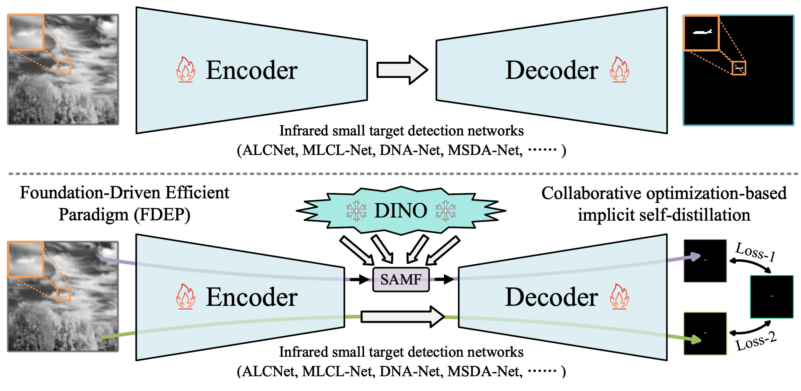
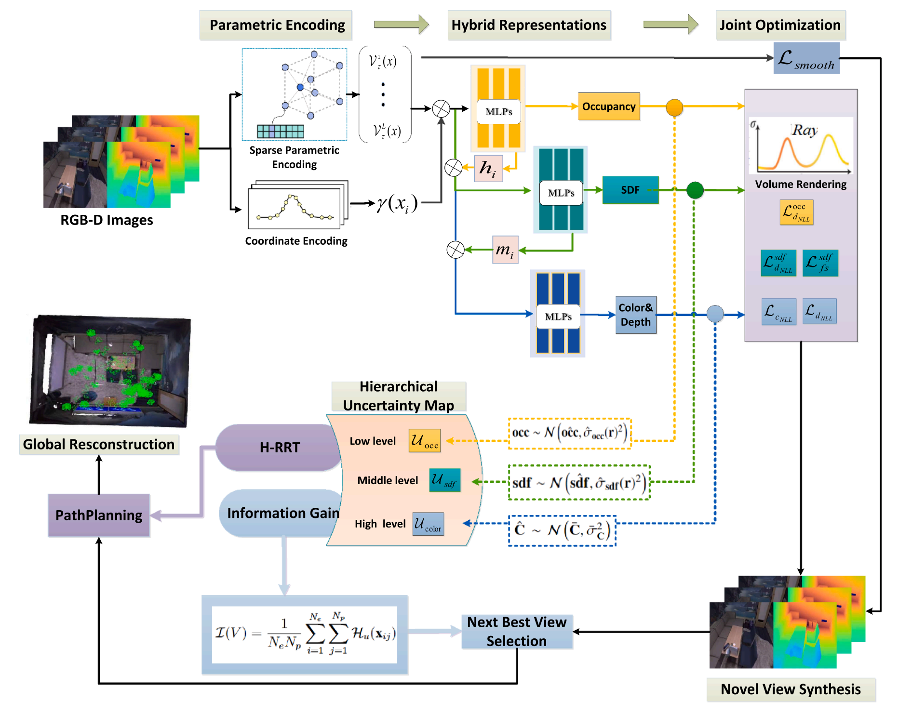

Welcome to my website!

I am a third-year PhD student in the Sun Yat-sen University's Master-Doctor combined program, supervised by [Guang Tan](https://scholar.google.com/citations?hl=zh-CN&user=JerZls4AAAAJ&view_op=list_works&sortby=pubdate) and [Chao Gou](https://scholar.google.com/citations?user=_0ad79AAAAAJ&hl=en). 

Since June 2024, I have been honored to be a visiting Ph.D at [MMLab](https://mmlab.ie.cuhk.edu.hk/people.html), CUHK, under the supervision of Prof. [Tianfan Xue](https://tianfan.info/).

My research interests primarily focus on video generation and 3D Reconstruction. I am open to collaboration and welcome further discussions if you are interested in my research. 

   
🔥 News 🔥
----- 
**∙** [2025.12] 🌟🌟 Our new work, ReCamDriving, is released! Check it out via [here](https://recamdriving.github.io/). 
**∙** [2025.10] 🌟🌟 Our new work, DynamicTree, is released! Check it out via [here](https://dynamictree-dev.github.io/DynamicTree.github.io/). 
**∙** [2025.10] 🎉🎉 One paper is accepted to PR 2025 
**∙** [2025.07] 🎉🎉 One paper is accepted to ICCV 2025 
**∙** [2024.12] 🎉🎉 One paper is accepted to AAAI 2025 
**∙** [2024.11] 🎉🎉 One paper is accepted to ESWA 2025 
**∙** [2023.11] 🎉🎉 One paper is accepted to IJCV 2024  

📑 Selected Publications 
-----

  
  

    <h3>ReCamDriving: LiDAR-Free Camera-Controlled Novel Trajectory Video Generation</h3>
    

      <strong><u>Yaokun Li</u></strong>, Shuaixian Wang, Mantang Guo, Jiehui Huang, Taojun Ding, Mu Hu, Kaixuan Wang, Shaijie Shen, Guang Tan 
      arXiv Preprint, 2025
    

    

      We introduce ReCamDriving, a vision-only framework for camera-controlled video generation, and ParaDrive, a large-scale dataset comprising 110K parallel-trajectory video pairs.
    

    

      <a href="https://recamdriving.github.io/">Project</a> |
      <a href="https://arxiv.org/abs/2512.03621">Paper</a> |
      <a href="https://github.com/Iron-LYK/ReCamDriving">Code</a>
    

  

  
  

    <h3>ReCamDriving: LiDAR-Free Camera-Controlled Novel Trajectory Video Generation</h3>
    

      <strong><u>Yaokun Li</u></strong>, Shuaixian Wang, Mantang Guo, Jiehui Huang, Taojun Ding, Mu Hu, Kaixuan Wang, Shaijie Shen, Guang Tan 
      arXiv Preprint, 2025
    

    

      We introduce ReCamDriving, a vision-only framework for camera-controlled video generation, and ParaDrive, a large-scale dataset comprising 110K parallel-trajectory video pairs.
    

    

      <a href="https://recamdriving.github.io/">Project</a> |
      <a href="https://arxiv.org/abs/2512.03621">Paper</a> |
      <a href="https://github.com/Iron-LYK/ReCamDriving">Code</a>
    

  

  
  

    <h3>FullPart: Generating each 3D Part at Full Resolution</h3>
    

      Lihe Ding*, Shaocong Dong*, <strong><u>Yaokun Li</u></strong>, Chenjian Gao, Xiao Chen, Rui Han, Yihao Kuang, Hong Zhang, Bo Huang, Zhanpeng Huang, Zibin Wang, Dan Xu†, Tianfan Xue† 
      <strong style="display:inline-block; margin:6px 0;">arXiv Preprint, 2025</strong>
    

    

      Fullpart generates each 3d part at full resolution. We also present PartVerse-XL, the largest human annotated 3d part dataset.
    

    

      <a href="https://fullpart3d.github.io/">Project</a> |
      <a href="https://arxiv.org/abs/2510.26140">Paper</a> |
      <a href="https://github.com/hkdsc/fullpart">Code</a>
    

  

  
  

    <h3>Rethinking Infrared Small Target Detection: A Foundation-Driven Efficient Paradigm</h3>
    

      Chuang Yu, Jinmiao Zhao, Yunpeng Liu, <strong><u>Yaokun Li</u></strong>, Xiujun Shu, Yuanhao Feng, Bo Wang, Yimian Dai, Xiangyu Yue 
      arXiv Preprint, 2025
    

    

      We propose FDEP, a foundation-driven efficient paradigm for single-frame infrared small target detection, alongside HSE, a holistic evaluation metric for fair model comparison.
    

    

      <a href="https://arxiv.org/pdf/2512.05511">Paper</a> |
      <a href="https://github.com/YuChuang1205/FDEP-Framework">Code</a>
    

  

  
  

    <h3>DynamicTree: Interactive Real Tree Animation via Sparse Voxel Spectrum</h3>
    

      <strong><u>Yaokun Li</u></strong>, Lihe Ding, Xiao Chen, Guang Tan, Tianfan Xue 
      arXiv Preprint, 2025
    

    

      We propose DynamicTree, the first framework that can generate long-term, interactive animation of 3D Gaussian Splatting trees.
    

    

      <a href="https://dynamictree-dev.github.io/DynamicTree.github.io/">Project</a> |
      <a href="https://arxiv.org/abs/2510.22213">Paper</a> |
      <a href="https://github.com/Iron-LYK/DynamicTree">Code</a> |
      <a href="https://github.com/Iron-LYK/DynamicTree">Data</a>
    

  

  
  

    <h3>From One to More: Contextual Part Latents for 3D Generation</h3>
    

      Shaocong Dong*, Lihe Ding*, Xiao Chen, <strong><u>Yaokun Li</u></strong>, Yuxin Wang, Yucheng Wang, Qi Wang, Jaehyeok Kim, Chenjian Gao, Zhanpeng Huang, Zibin Wang, Tianfan Xue†, Dan Xu† 
      <strong style="display:inline-block; margin:6px 0;">ICCV 2025</strong>
    

    

      Copart generates 3d parts from contextual part latents and supports various applications, such as articulation modeling.
    

    

      <a href="https://hkdsc.github.io/project/copart/">Project</a> |
      <a href="https://arxiv.org/abs/2507.08772">Paper</a> |
      <a href="https://github.com/hkdsc/copart">Code</a> |
      <a href="https://huggingface.co/datasets/dscdyc/partverse/tree/main">Data</a>
    

  

  
  

    <h3>Learning hierarchical uncertainty from hybrid representations for neural active reconstruction</h3>
    

      Shuaixian Wang, <strong><u>Yaokun Li</u></strong>, Chenhui Guo, Guang Tan 
      <strong style="display:inline-block; margin:6px 0;">PR 2025</strong>
    

    

    We propose a neural active reconstruction system that leverages hierarchical uncertainty across hybrid implicit representations to optimize next-best-view planning and high-fidelity 3D reconstruction.
    

    

      <a href="https://www.sciencedirect.com/science/article/pii/S0031320325011562">Paper</a>
    

  

  
  

    <h3>ID-NeRF: Indirect Diffusion-Guided Neural Radiance Fields for Generalizable View Synthesis</h3>
    

      <strong><u>Yaokun Li</u></strong>, Shuaixian Wang, Guang Tan 
      <strong style="display:inline-block; margin:6px 0;">ESWA 2025</strong>
    

    

    We propose ID-NeRF, a generalizable novel view synthesis framework that addresses sub-optimal reprojected features by indirectly distilling pre-trained diffusion priors into an imaginative latent space for feature refinement.
    

    

      <a href="https://www.sciencedirect.com/science/article/abs/pii/S095741742402935X">Paper</a>
    

  

  
  

    <h3>Cascaded Iterative Transformer for Jointly Predicting Facial Landmark, Occlusion Probability and Head Pose</h3>
    

      <strong><u>Yaokun Li</u></strong>, Guang Tan, Chao Gou 
      <strong style="display:inline-block; margin:6px 0;">IJCV 2024</strong>
    

    

    We propose CIT, a cascaded iterative transformer that explicitly exploits task dependencies for facial analysis, along with MERL-RAV-FLOP, the first dataset providing joint annotations for landmarks, occlusion, and pose.
    

    

      <a href="https://doi.org/10.1007/s11263-023-01935-2">Paper</a> |
      <a href="https://github.com/Iron-LYK/CIT">Code</a>
    

  

🏆 Awards 
----- 
∙ \(2019\) China National Scholarship  
∙ \(2020\) Polytechnic Youth Top Ten Students  
∙ \(2022\) Honorable mention in HACKPKU 2022  
∙ \(2023\) Third Prize of 2023 "Huawei Cup" National Graduate Student Mathematical Modeling Competition  

📝 Academic Service 
----- 
Reviewer:  
∙ Conference Reviewer: CVPR, ECCV, AAAI, ...  
∙ Journal Reviewer: IJCV, TCSVT, PR, ...S  

📖 Teaching 
----- 
∙ Teaching Assistant: IERG4190-IEMS5707 Multimedia Coding and Processing, CUHK, 2024R2 
∙ Teaching Assistant: ISE3111 Pattern Recognition & Machine Learning, SYSU, 2022 Fall 

😻 My Hobbies
----- 
🏃‍♂️ 🏀 🏋 🎧 📷 ...
