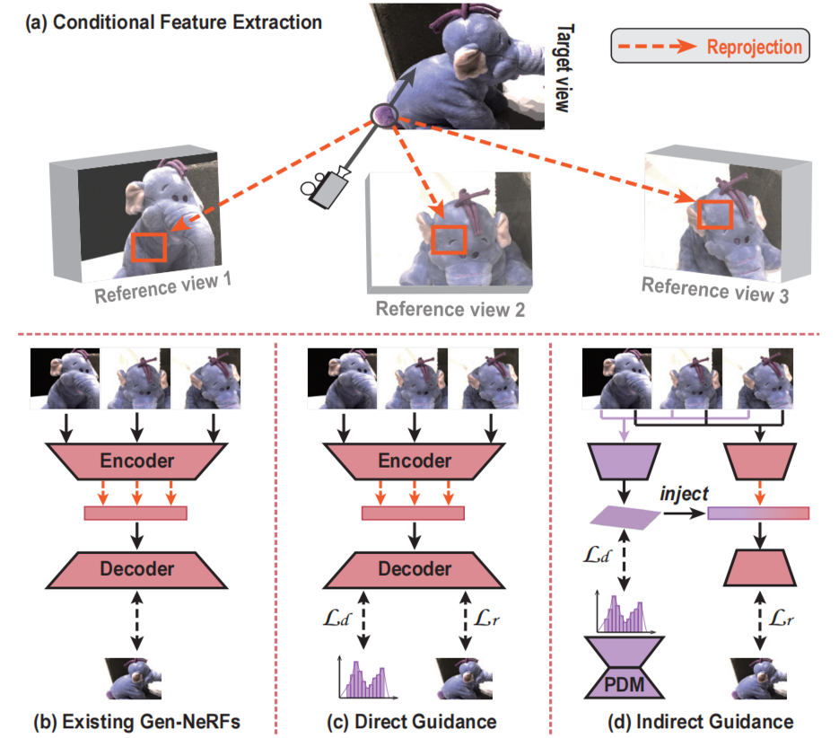
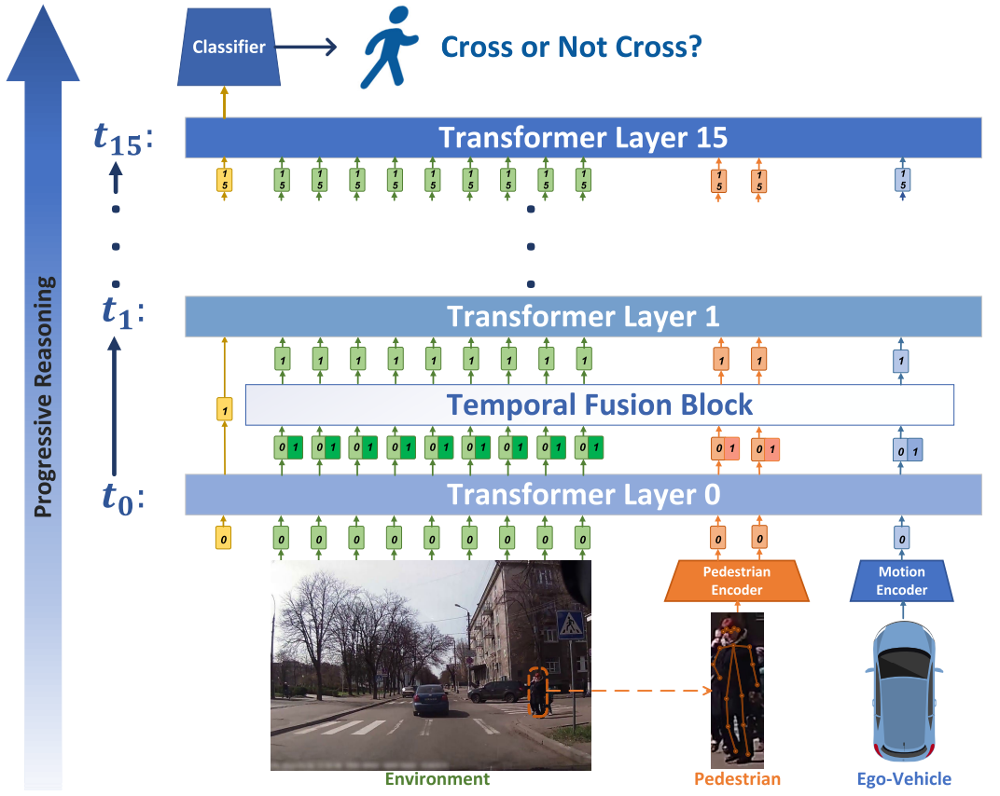

Welcome to my website!

I am a third-year master's student in the [School of Intelligent Systems Engineering](https://ise.sysu.edu.cn/index.htm) at [Sun Yat-sen University](https://www.sysu.edu.cn/sysuen/), supervised by [Prof. Guang Tan](https://ise.sysu.edu.cn/teacher/teacher01/1354976.htm) and [Assoc. Prof. Chao Gou](https://chaogou.github.io/). Prior to this, I earned my B.Eng. degree from the School of Automotive Engineering at [Wuhan University of Technology](http://english.whut.edu.cn/) in 2021.  

I have a broad interest in the exciting field of 3D vision, focusing mainly on: 

👉 **Generalizable neural representations:** Dedicated to advancing lightweight, generalizable 3D representations for future general AI. 

👉 **Sparse-view 3D Reconstruction/Generation:** Striving to solve the ill-posed spare reconstruction issue, especially from a generative perspective. 

Moreover, I am also interested in face analysis/editing, which I have done some work on before. 

[Google Scholar](https://scholar.google.com.hk/citations?hl=en&view_op=list_works&authuser=1&gmla=AH70aAXzHZsmUfNdNZ-ZxUUQch_wz3OjkERjPqQVZklCFS9UTowHTxCJWtp60drsx3o3-Ra6hCbX7ymcWN_1PJZddFg7&user=plCD9wwAAAAJ) / [Twitter](https://twitter.com/iron_lyk) / [CSDN](https://blog.csdn.net/DUDUDUTU?spm=1000.2115.3001.5343) / <a href="https://Iron-LYK.github.io/files/CV.pdf">CV</a>
   
🔥 News 🔥
----- 
**∙** [2024.02] 🌟🌟 Our new work, ID-NeRF, is released! Please check it on [arXiv](https://arxiv.org/search/cs). 
**∙** [2023.11] 🎉🎉 One paper CIT is accepted to IJCV  
**∙** [2023.09] 🎉🎉 One paper PIT is accepted to TITS  
**∙** [2022.07] 🎉🎉 One paper MS-GCN is accepted to ITSC 2022  
**∙** [2021.09] 🚀🚀 Start my journey at [ISE@SYSU](https://ise.sysu.edu.cn/) 

📑 Preprints 
-----

### Taming Uncertainty in Sparse-view Generalizable NeRF via Indirect Diffusion Guidance

<strong>Yaokun Li</strong>, Chao Gou, Guang Tan   
arXiv Preprint, 2024  
<a href="https://arxiv.org/search/cs">Paper</a>
 

📑 Publications 
----- 
 
### Cascaded Iterative Transformer for Jointly Predicting Facial Landmark, Occlusion Probability and Head Pose 

 
 
<strong>Yaokun Li</strong>, Guang Tan, Chao Gou   
International Journal of Computer Vision (<strong>IJCV 2023</strong>)  
<a href="https://doi.org/10.1007/s11263-023-01935-2">Paper</a> | 
<a href="https://github.com/Iron-LYK/CIT">Code</a>
 

---
 
### PIT: Progressive Interaction Transformer for Pedestrian Crossing Intention Prediction 

 
 
Yuchen Zhou, Guang Tan, Rui Zhong, <strong>Yaokun Li</strong>, Chao Gou  
IEEE Transactions on Intelligent Transportation Systems (<strong>TITS 2023</strong>)  
<a href="https://ieeexplore.ieee.org/abstract/document/10247098">Paper</a>
  
 

 
---
 
### MS-GCN: Multi-Stream Graph Convolution Network for Driver Head Pose Estimation 

 
 
<strong>Yaokun Li</strong>, Yuezhao Yu, Yuliang Liu, Chao Gou  
IEEE International Conference on Intelligent Transportation Systems (<strong>ITSC 2022</strong>)  
<a href="https://ieeexplore.ieee.org/abstract/document/9922277">Paper</a>
  
 

 
 

🏆 Awards 
----- 
∙ \(2019\) **China National Scholarship**  
∙ \(2022\) Honorable mention in HACKPKU 2022  
∙ \(2023\) Third Prize of 2023 "Huawei Cup" National Graduate Student Mathematical Modeling Competition  

📝 Academic Service 
----- 
Reviewer:  
∙ Journal Reviewer: IJCV, TIV  
∙ Conference Reviewer: ITSC  

📖 Teaching 
----- 
∙ Teaching Assistant: ISE3111 Pattern Recognition & Machine Learning, SYSU, 2022 Fall 

😻 My Hobbies
----- 
🏃‍♂️ 🏀 🏋 🎧 📷 ...
